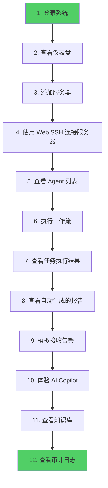

# 第3章 第一次使用

## 作者

**谭策** — 独立开发者 | AIOps 领域探索者

- 🌐 项目官网：[ITOpsAgentinfo](https://www.zjzwfw.cloud/ITOpsAgentinfo)
- 📝 博客：[zjzwfw.cloud](https://www.zjzwfw.cloud/)
- 📧 邮箱：<huawei_network@foxmail.com>
- 💬 微信公众号：**IT Online**

<p align="left">
  
</p>

## 许可证

[MPL-2.0](../../LICENSE) © 谭策

## 本章导读

### 本章学习目标

完成本章学习后，你将能够：

- ✅ 使用默认账号登录系统
- ✅ 理解系统的整体界面布局
- ✅ 添加第一台服务器
- ✅ 查看和配置 Agent
- ✅ 创建并执行第一个工作流
- ✅ 查看任务执行结果和报告
- ✅ 体验告警中心和 AI Copilot

### 前置知识要求

- ✅ 第1章：了解项目是什么
- ✅ 第2章：项目已成功部署并运行
- ✅ 能使用浏览器和基本的网页操作

### 预计学习时间

45-60 分钟

---

## 3.1 登录系统

### 3.1.1 访问登录页面

打开浏览器，访问以下地址：

```
Docker 部署: http://localhost:8080
本地开发:    http://localhost:5173
```

你会看到一个精美的登录页面：

```
┌─────────────────────────────────────────────────────┐
│                                                     │
│            ░░░░░  粒子背景动画  ░░░░░               │
│                                                     │
│         ┌─────────────────────────────┐            │
│         │   🤖 ITOps Agent Platform   │            │
│         │                             │            │
│         │   用户名: [____________]    │            │
│         │   密  码: [____________]    │            │
│         │                             │            │
│         │   [        登录        ]    │            │
│         │                             │            │
│         │   默认账号: admin / admin   │            │
│         └─────────────────────────────┘            │
│                                                     │
└─────────────────────────────────────────────────────┘
```

### 3.1.2 输入默认账号

在登录表单中输入：

| 字段 | 输入值 |
|------|--------|
| 用户名 | `admin` |
| 密码 | `admin` |

> 💡 **提示**：如果你使用一键脚本部署，脚本可能会在终端显示一个随机生成的初始密码。请使用那个密码登录。

点击 **登录** 按钮。

### 3.1.3 首次登录强制修改密码

如果是首次登录，系统会要求你修改密码：

```
┌─────────────────────────────────────────────────────┐
│          ⚠️ 首次登录，请修改初始密码                  │
│                                                     │
│          当前密码: [____________]                    │
│          新密码:   [____________]                    │
│          确认密码: [____________]                    │
│                                                     │
│          [        确认修改        ]                  │
│                                                     │
│          密码要求：至少 6 位字符                      │
└─────────────────────────────────────────────────────┘
```

**为什么强制改密码？**
这是重要的安全措施。默认密码是公开的，如果不修改，任何人都能登录你的系统。

---

## 3.2 认识系统界面

登录成功后，你会看到系统的主界面。让我们先来认识一下界面布局：

```
┌──────────────────────────────────────────────────────────────┐
│  🤖 ITOps Agent                           admin [退出] [🌙]  │ ← 顶栏
├────────────┬─────────────────────────────────────────────────┤
│            │                                                 │
│  📊 仪表盘  │                                                 │
│  🖥️ 服务器  │              页面内容区域                        │
│  🤖 Agent  │                                                 │
│  🔗 工作流  │              这里显示当前页面的                   │
│  ▶️ 任务    │              具体内容和操作界面                   │
│  🚨 告警   │                                                 │
│  💻 终端   │                                                 │
│  📚 知识库  │                                                 │
│  📝 报告   │                                                 │
│  📋 审计   │                                                 │
│  ⚙️ 设置   │                                                 │
│            │                                                 │
│  ← 侧边栏   │                                                 │
└────────────┴─────────────────────────────────────────────────┘
```

### 界面组件说明

| 组件 | 位置 | 功能 |
|------|------|------|
| **顶栏** | 顶部 | 显示系统名称、当前用户、退出登录、主题切换 |
| **侧边栏** | 左侧 | 导航菜单，点击跳转到不同页面 |
| **内容区** | 中间 | 当前页面的具体内容 |
| **折叠按钮** | 侧边栏顶部 | 点击可折叠/展开侧边栏 |

### 导航菜单说明

| 菜单 | 说明 | 对应功能 |
|------|------|---------|
| 📊 仪表盘 | 系统概览 | 查看服务器、告警、任务等统计信息 |
| 🖥️ 服务器 | 服务器管理 | 添加、编辑、删除被管理的服务器 |
| 🤖 Agent | Agent 管理 | 查看和配置 AI Agent |
| 🔗 工作流 | 工作流编排 | 创建和编辑自动化工作流 |
| ▶️ 任务 | 任务执行 | 查看任务执行历史和结果 |
| 🚨 告警 | 告警中心 | 查看和管理告警信息 |
| 💻 终端 | Web SSH | 在浏览器中连接远程服务器 |
| 📚 知识库 | 知识管理 | 管理运维知识条目 |
| 📝 报告 | 报告中心 | 查看工作流执行报告 |
| 📋 审计 | 审计日志 | 查看所有操作记录 |
| ⚙️ 设置 | 系统设置 | 系统配置和用户管理 |

> 💡 **提示**：侧边栏菜单可以根据你的权限显示不同内容。管理员看到所有菜单，普通用户可能只看到部分菜单。

---

## 3.3 仪表盘 — 系统总览

点击侧边栏的 **📊 仪表盘**，进入系统主页面。

### 3.3.1 概览卡片

仪表盘顶部显示几个关键指标卡片：

```
┌──────────────┐ ┌──────────────┐ ┌──────────────┐ ┌──────────────┐
│   🖥️ 服务器   │ │   🚨 告警    │ │   ▶️ 任务    │ │   🤖 Agent  │
│              │ │              │ │              │ │              │
│      0       │ │      0       │ │      0       │ │      9       │
│              │ │              │ │              │ │              │
└──────────────┘ └──────────────┘ └──────────────┘ └──────────────┘
```

**卡片说明**：
- **服务器**：已添加的服务器总数
- **告警**：当前活跃告警数量
- **任务**：已执行的任务总数
- **Agent**：可用的 Agent 数量（预设 9 个）

### 3.3.2 统计图表

仪表盘下方显示可视化图表：

- **告警趋势图**：最近 7 天的告警数量变化（折线图）
- **任务执行统计**：按状态分类的任务数量（柱状图）
- **服务器状态分布**：在线/离线服务器占比（饼图）

> 💡 **第一次使用**：由于是全新系统，这些数据都是 0。随着你添加服务器和执行任务，这些图表会越来越丰富。

---

## 3.4 添加第一台服务器

现在让我们来添加第一台被管理的服务器。这是使用系统的第一个实际操作！

### 3.4.1 进入服务器管理页面

点击侧边栏的 **🖥️ 服务器**，进入服务器管理页面。

### 3.4.2 添加服务器

点击页面右上角的 **"添加服务器"** 按钮，弹出添加表单：

```
┌─────────────────────────────────────────────┐
│          添加服务器                          │
│                                             │
│  服务器名称: [ My-First-Server _______]      │
│  主机地址:   [ 192.168.1.100 ________]      │
│  SSH 端口:   [ 22 _________________]        │
│  SSH 用户名: [ root _______________]        │
│  认证方式:   (●) 密码  ( ) 密钥             │
│  密码:       [ ••••••••___________]        │
│  描述:       [ 测试服务器 ________]        │
│  标签:       [ 测试, 开发 _______]         │
│                                             │
│          [ 取消 ]    [ 确认添加 ]           │
└─────────────────────────────────────────────┘
```

### 3.4.3 字段说明

| 字段 | 说明 | 示例值 | 是否必填 |
|------|------|--------|---------|
| 服务器名称 | 给服务器起的名字 | `Web-Server-01` | ✅ 必填 |
| 主机地址 | 服务器的 IP 地址或域名 | `192.168.1.100` | ✅ 必填 |
| SSH 端口 | SSH 服务端口，默认 22 | `22` | 可选 |
| SSH 用户名 | 登录服务器的用户名 | `root` 或 `ubuntu` | ✅ 必填 |
| 认证方式 | 密码 或 SSH 密钥 | 密码 | ✅ 必填 |
| 密码/密钥 | 认证凭据（会自动加密存储） | `your-password` | ✅ 必填 |
| 描述 | 服务器的用途说明 | `生产 Web 服务器` | 可选 |
| 标签 | 逗号分隔的标签 | `生产, Web, 华东` | 可选 |

> 🔒 **安全提示**：你输入的密码会使用 AES-256-GCM 加密后存储到数据库。即使数据库文件被泄露，攻击者也无法直接获取密码。

### 3.4.4 测试连接

添加服务器后，可以点击 **"测试连接"** 按钮验证是否能成功 SSH 连接到服务器：

```
测试连接中...
│
├─ 正在连接到 192.168.1.100:22...
├─ 认证成功！
├─ 操作系统: Ubuntu 22.04 LTS
├─ CPU: 4 cores
├─ 内存: 8192 MB
└─ ✅ 连接成功！
```

### 3.4.5 服务器列表

添加成功后，服务器会出现在列表中：

```
┌──────────────────────────────────────────────────────────────────┐
│  服务器列表                    [+ 添加服务器] [📥 导入] [📤 导出] │
├──────────────────────────────────────────────────────────────────┤
│                                                                  │
│  ┌────────────────────────────────────────────────────────┐     │
│  │  🖥️ My-First-Server                                   │     │
│  │  ───────────────────────────────────────────────────── │     │
│  │  地址: 192.168.1.100:22        状态: 🟢 在线           │     │
│  │  用户: root                    系统: Ubuntu 22.04      │     │
│  │  CPU: 4 核      内存: 8 GB     磁盘: 100 GB            │     │
│  │  标签: [测试] [开发]                                    │     │
│  │  ───────────────────────────────────────────────────── │     │
│  │  [🔗 连接] [✏️ 编辑] [🗑️ 删除] [📋 合规检查]           │     │
│  └────────────────────────────────────────────────────────┘     │
│                                                                  │
└──────────────────────────────────────────────────────────────────┘
```

### 3.4.6 使用 Web SSH 终端连接服务器

点击服务器卡片上的 **🔗 连接** 按钮，或直接点击侧边栏的 **💻 终端**，进入 Web SSH 终端页面。

选择你刚才添加的服务器，点击连接：

```
┌─────────────────────────────────────────────────────────────┐
│  SSH 终端 - My-First-Server (192.168.1.100)        [🔴 断开] │
├─────────────────────────────────────────────────────────────┤
│                                                             │
│  Welcome to Ubuntu 22.04.3 LTS (GNU/Linux 5.15.0 x86_64)   │
│                                                             │
│  Last login: Mon May 27 10:30:00 2026                       │
│                                                             │
│  root@my-first-server:~$ ls -la                             │
│  total 28                                                   │
│  drwx------  4 root root 4096 May 27 10:00 .               │
│  drwxr-xr-x 20 root root 4096 May 27 09:00 ..              │
│  -rw-r--r--  1 root root 3106 May 27 09:00 .bashrc         │
│  -rw-r--r--  1 root root  161 May 27 09:00 .profile        │
│                                                             │
│  root@my-first-server:~$ df -h                              │
│  Filesystem      Size  Used Avail Use% Mounted on           │
│  /dev/sda1       100G   25G   75G  25% /                    │
│  tmpfs           3.9G     0  3.9G   0% /dev/shm             │
│                                                             │
│  root@my-first-server:~$ █                                  │
│                                                             │
└─────────────────────────────────────────────────────────────┘
```

**你可以像在本地终端一样操作**：
- 输入命令后按回车执行
- 使用上下箭头键翻看历史命令
- 使用 Tab 键自动补全命令
- 使用 Ctrl+C 中断当前命令

---

## 3.5 查看 Agent

点击侧边栏的 **🤖 Agent**，进入 Agent 管理页面。

### 3.5.1 预设 Agent 列表

系统已经预置了 9 个 Agent：

```
┌──────────────────────────────────────────────────────────────────┐
│  Agent 列表                        [+ 创建 Agent]                │
├──────────────────────────────────────────────────────────────────┤
│                                                                  │
│  ┌──────────┐ ┌──────────┐ ┌──────────┐ ┌──────────┐           │
│  │ 🚨       │ │ 🔍       │ │ 📋       │ │ 🔎       │           │
│  │ 告警处理  │ │ 故障诊断  │ │ 日志分析  │ │ 系统巡检  │           │
│  │          │ │          │ │          │ │          │           │
│  │ 分析告警  │ │ 定位根因  │ │ 分析日志  │ │ 检查健康  │           │
│  └──────────┘ └──────────┘ └──────────┘ └──────────┘           │
│                                                                  │
│  ┌──────────┐ ┌──────────┐ ┌──────────┐ ┌──────────┐           │
│  │ 🔄       │ │ 📝       │ │ ✅       │ │ 💻       │           │
│  │ 变更执行  │ │ 文档生成  │ │ 合规检查  │ │ 命令执行  │           │
│  │          │ │          │ │          │ │          │           │
│  │ 安全变更  │ │ 生成报告  │ │ 合规审计  │ │ 远程操作  │           │
│  └──────────┘ └──────────┘ └──────────┘ └──────────┘           │
│                                                                  │
│  ┌──────────┐                                                    │
│  │ 🤖       │                                                    │
│  │ 自动巡检  │                                                    │
│  │          │                                                    │
│  │ 定时巡检  │                                                    │
│  └──────────┘                                                    │
│                                                                  │
└──────────────────────────────────────────────────────────────────┘
```

### 3.5.2 查看 Agent 详情

点击任意 Agent 卡片，可以查看其详细配置：

```
┌─────────────────────────────────────────────┐
│  🚨 告警处理 Agent                           │
│                                             │
│  描述: 分析接收到的告警信息，评估严重程度，  │
│       提供处理建议。                         │
│                                             │
│  模型: doubao-4o                            │
│  温度: 0.7                                  │
│                                             │
│  系统提示词:                                │
│  ┌───────────────────────────────────────┐  │
│  │ 你是一个专业的运维告警处理专家。       │  │
│  │ 你的职责是：                           │  │
│  │ 1. 分析告警信息的严重程度              │  │
│  │ 2. 判断是否需要立即处理                │  │
│  │ 3. 提供具体的处理建议                  │  │
│  │ 4. 如果有相关知识，结合知识给出答案    │  │
│  └───────────────────────────────────────┘  │
│                                             │
│  [▶️ 测试] [✏️ 编辑] [📋 执行历史]          │
└─────────────────────────────────────────────┘
```

**关键字段说明**：

| 字段 | 说明 |
|------|------|
| 系统提示词 | 定义 Agent 的行为和能力，相当于"角色设定" |
| 模型 | 使用的 AI 模型（豆包、OpenAI 等） |
| 温度 | 控制输出的随机性（0=确定性强，1=创意性强） |

### 3.5.3 测试 Agent

点击 **▶️ 测试** 按钮，可以测试 Agent 的响应：

```
┌─────────────────────────────────────────────┐
│  测试 Agent                                  │
│                                             │
│  输入: 服务器 CPU 使用率达到 95% 该怎么办？   │
│                                             │
│  [发送]                                     │
│                                             │
│  ───────────────────────────────────────── │
│                                             │
│  Agent 回复:                                │
│  CPU 使用率达到 95%属于严重告警，建议：       │
│  1. 立即检查是否有异常进程占用 CPU           │
│  2. 使用 top 命令查看具体进程                │
│  3. 如果是正常业务负载，考虑扩容             │
│  4. 如果是异常进程，考虑终止并排查原因        │
│                                             │
└─────────────────────────────────────────────┘
```

---

## 3.6 创建工作流

工作流是项目的核心功能。让我们来创建第一个工作流！

### 3.6.1 进入工作流页面

点击侧边栏的 **🔗 工作流**，进入工作流管理页面。

### 3.6.2 预设工作流模板

系统已经预置了 6 个工作流模板：

| 工作流名称 | 说明 | 节点数 |
|-----------|------|--------|
| 告警处理流程 | 接收告警 → 分析 → 诊断 → 修复 | 4 |
| 系统巡检流程 | 巡检所有服务器 → 生成报告 | 2 |
| 日志分析流程 | 收集日志 → 分析 → 生成报告 | 3 |
| 变更执行流程 | 变更检查 → 执行变更 → 验证 | 3 |
| 合规检查流程 | 执行合规检查 → 生成报告 | 2 |
| 故障诊断流程 | 收集信息 → 分析 → 定位根因 → 提供方案 | 4 |

### 3.6.3 创建自定义工作流

点击 **"+ 创建工作流"** 按钮，进入工作流编辑器。

```
┌─────────────────────────────────────────────────────────────┐
│  创建工作流                                      [💾 保存]    │
├──────────────┬──────────────────────────────────────────────┤
│              │                                              │
│  节点库       │              画布区域                         │
│              │                                              │
│  ┌────────┐  │                                              │
│  │ 🤖     │  │    拖拽节点到这里                               │
│  │ Agent  │  │                                              │
│  │ 节点   │──┼───▶  ┌──────────┐      ┌──────────┐          │
│  └────────┘  │      │ Agent 1  │─────▶│ Agent 2  │          │
│              │      └──────────┘      └──────────┘          │
│  ┌────────┐  │                                              │
│  │ ⚡     │  │                                              │
│  │ 条件   │  │                                              │
│  │ 节点   │  │                                              │
│  └────────┘  │                                              │
│              │                                              │
├──────────────┴──────────────────────────────────────────────┤
│  工作流名称: [ 我的第一个工作流 _______ ]                     │
│  描述:       [ 用于测试的工作流 _______ ]                     │
└─────────────────────────────────────────────────────────────┘
```

### 3.6.4 使用预设工作流

为了快速体验，我们直接使用预设的"系统巡检流程"：

1. 在工作流列表中找到 **系统巡检流程**
2. 点击卡片进入详情页
3. 点击 **▶️ 执行** 按钮

```
┌─────────────────────────────────────────────┐
│  执行工作流                                  │
│                                             │
│  工作流: 系统巡检流程                        │
│                                             │
│  选择服务器:                                 │
│  ☑️ My-First-Server (192.168.1.100)         │
│                                             │
│  执行上下文 (可选):                          │
│  ┌───────────────────────────────────────┐  │
│  │ 请检查服务器的健康状态，               │  │
│  │ 包括 CPU、内存、磁盘使用情况。         │  │
│  └───────────────────────────────────────┘  │
│                                             │
│          [ 取消 ]    [ 确认执行 ]           │
└─────────────────────────────────────────────┘
```

选择你之前添加的服务器，点击 **确认执行**。

### 3.6.5 查看执行进度

执行开始后，系统会通过 WebSocket 实时推送执行进度：

```
┌─────────────────────────────────────────────────────────────┐
│  任务执行中...                                  [⏸️ 暂停]     │
├─────────────────────────────────────────────────────────────┤
│                                                             │
│  ┌──────────┐      ┌──────────┐                            │
│  │ 📋 步骤1 │ ───▶ │ 🤖 步骤2 │                            │
│  │ 收集信息  │      │ 分析巡检  │                            │
│  │ ✅ 完成  │      │ ⏳ 执行中 │                            │
│  └──────────┘      └──────────┘                            │
│                                                             │
│  ───────────────────────────────────────────────────────   │
│                                                             │
│  实时日志:                                                  │
│  [10:30:00] 任务开始执行                                    │
│  [10:30:01] 节点1 (收集信息) 开始执行                       │
│  [10:30:02] 正在连接服务器 My-First-Server...              │
│  [10:30:03] 服务器连接成功                                  │
│  [10:30:04] 正在收集系统信息...                             │
│  [10:30:05] CPU: 45%  内存: 62%  磁盘: 25%                │
│  [10:30:06] 节点1 (收集信息) 执行完成                       │
│  [10:30:06] 节点2 (分析巡检) 开始执行                       │
│  [10:30:07] 正在调用 AI Agent 分析...                      │
│  [10:30:15] Agent 分析完成                                  │
│  [10:30:16] 节点2 (分析巡检) 执行完成                       │
│  [10:30:16] 任务执行完成！                                  │
│                                                             │
└─────────────────────────────────────────────────────────────┘
```

---

## 3.7 查看任务和报告

### 3.7.1 查看任务列表

点击侧边栏的 **▶️ 任务**，进入任务管理页面。

```
┌──────────────────────────────────────────────────────────────────┐
│  任务列表                                                        │
├──────────────────────────────────────────────────────────────────┤
│                                                                  │
│  ┌────────────────────────────────────────────────────────┐     │
│  │  任务 #1                                                │     │
│  │  ───────────────────────────────────────────────────── │     │
│  │  工作流: 系统巡检流程                                    │     │
│  │  状态: ✅ 完成                                          │     │
│  │  开始时间: 2026-05-27 10:30:00                         │     │
│  │  结束时间: 2026-05-27 10:30:16                         │     │
│  │  耗时: 16 秒                                           │     │
│  │  ───────────────────────────────────────────────────── │     │
│  │  [👁️ 查看] [📝 报告] [🔄 重新执行]                     │     │
│  └────────────────────────────────────────────────────────┘     │
│                                                                  │
└──────────────────────────────────────────────────────────────────┘
```

### 3.7.2 查看任务详情

点击 **👁️ 查看**，可以看到任务的完整执行过程，包括每个节点的输入输出。

### 3.7.3 查看报告

点击 **📝 报告**，查看自动生成的 Markdown 格式执行报告：

```markdown
# 工作流执行报告

## 基本信息
- 工作流名称: 系统巡检流程
- 执行时间: 2026-05-27 10:30:00
- 执行状态: ✅ 完成
- 总耗时: 16 秒
- 执行服务器: My-First-Server (192.168.1.100)

## 执行详情

### 节点 1: 收集系统信息
- 状态: ✅ 完成
- 耗时: 5 秒
- 结果:
  - CPU 使用率: 45%
  - 内存使用率: 62% (已用 5.1GB / 总共 8GB)
  - 磁盘使用率: 25% (已用 25GB / 总共 100GB)
  - 操作系统: Ubuntu 22.04 LTS
  - 运行时间: 15 天

### 节点 2: 分析巡检结果
- 状态: ✅ 完成
- 耗时: 9 秒
- 分析结果:
  服务器整体健康状态良好。
  - CPU 使用率正常（45% < 80% 阈值）
  - 内存使用率偏高（62% > 60% 阈值），建议关注
  - 磁盘使用率正常（25% < 80% 阈值）

## 总结
服务器运行正常，内存使用率稍高，建议定期检查。
```

---

## 3.8 体验告警中心

### 3.8.1 查看告警列表

点击侧边栏的 **🚨 告警**，进入告警中心。

```
┌──────────────────────────────────────────────────────────────────┐
│  告警列表                                                        │
├──────────────────────────────────────────────────────────────────┤
│                                                                  │
│  当前没有告警。                                                   │
│  告警将通过 Webhook 从监控系统自动接收。                          │
│                                                                  │
│  Webhook 地址: http://your-server:3001/api/webhooks/alerts       │
│                                                                  │
└──────────────────────────────────────────────────────────────────┘
```

### 3.8.2 手动创建告警（用于测试）

虽然告警通常由监控系统自动推送，但我们可以手动模拟：

```bash
# 使用 curl 模拟 Prometheus 告警
curl -X POST http://localhost:3001/api/webhooks/alerts/prometheus \
  -H "Content-Type: application/json" \
  -d '{
    "alerts": [{
      "status": "firing",
      "labels": {
        "alertname": "HighCPUUsage",
        "instance": "192.168.1.100:9100",
        "severity": "critical"
      },
      "annotations": {
        "summary": "CPU usage is above 90%",
        "description": "CPU usage has been above 90% for 5 minutes"
      }
    }]
  }'
```

收到告警后，刷新告警中心页面：

```
┌──────────────────────────────────────────────────────────────────┐
│  告警列表                                                        │
├──────────────────────────────────────────────────────────────────┤
│                                                                  │
│  ┌────────────────────────────────────────────────────────┐     │
│  │  🔴 HighCPUUsage                                        │     │
│  │  ───────────────────────────────────────────────────── │     │
│  │  来源: Prometheus          严重程度: Critical           │     │
│  │  状态: 🆕 新建                                           │     │
│  │  CPU usage has been above 90% for 5 minutes            │     │
│  │  时间: 2026-05-27 10:35:00                             │     │
│  │  ───────────────────────────────────────────────────── │     │
│  │  [👁️ 查看] [✅ 确认] [🔗 触发工作流]                    │     │
│  └────────────────────────────────────────────────────────┘     │
│                                                                  │
└──────────────────────────────────────────────────────────────────┘
```

### 3.8.3 告警触发工作流

点击 **🔗 触发工作流**，可以选择一个工作流来自动处理这个告警：

```
选择工作流:
☑️ 告警处理流程
☐ 故障诊断流程
☐ 系统巡检流程

[ 确认触发 ]
```

选择后，系统会自动执行选定的工作流来处理告警。

---

## 3.9 体验 AI Copilot

### 3.9.1 打开 Copilot

在页面右下角，你会看到一个聊天气泡图标 💬。点击它，打开 AI Copilot 对话框：

```
┌─────────────────────────────────────────────┐
│  🤖 AI Copilot                       [✕]    │
├─────────────────────────────────────────────┤
│                                             │
│  AI: 你好！我是 ITOps Agent 智能助手。       │
│      有什么可以帮你的吗？                    │
│                                             │
│  💡 你可以问我：                              │
│  • 当前系统有什么告警？                      │
│  • 帮我分析一下服务器状态                    │
│  • 有什么需要处理的任务？                    │
│                                             │
├─────────────────────────────────────────────┤
│  [ 输入你的问题...                    ] [发送]│
└─────────────────────────────────────────────┘
```

### 3.9.2 与 Copilot 对话

试着问几个问题：

**问题 1：查看系统状态**

```
你: 当前系统状态如何？

AI Copilot: 当前系统状态概览：

📊 服务器: 1 台（1 台在线）
🚨 告警: 1 个活跃告警（HighCPUUsage - Critical）
📋 任务: 1 个已完成
🤖 Agent: 9 个可用

需要我帮你处理那个 Critical 级别的告警吗？
```

**问题 2：处理告警**

```
你: 帮我处理 CPU 告警

AI Copilot: 好的，让我来分析一下...

根据告警信息，服务器 192.168.1.100 的 CPU 使用率
超过 90% 已持续 5 分钟。

建议操作步骤：
1. 通过 Web SSH 终端登录服务器
2. 执行 top 命令查看占用 CPU 最高的进程
3. 如果是异常进程，可以执行 kill 命令终止
4. 如果是正常业务负载，考虑扩容或优化

要我帮你创建一个故障诊断工作流来自动分析吗？
```

**问题 3：一般运维问题**

```
你: Linux 服务器磁盘满了怎么办？

AI Copilot: 磁盘空间不足的排查和处理步骤：

1. 查看磁盘使用情况
   df -h

2. 查找大文件
   du -sh /* | sort -rh | head -20

3. 清理常见的大文件目录
   - 清理日志: rm -rf /var/log/*.gz
   - 清理临时文件: rm -rf /tmp/*
   - 清理包管理器缓存: apt-get clean

4. 查找并删除不必要的大文件
   find / -type f -size +100M -exec ls -lh {} \;

需要我帮你在具体服务器上执行这些操作吗？
```

---

## 3.10 体验知识库

### 3.10.1 查看知识库

点击侧边栏的 **📚 知识库**，进入知识管理页面。

系统已经预置了 22 条运维知识，例如：

| 标题 | 分类 |
|------|------|
| CPU 使用率过高的排查步骤 | 性能问题 |
| 内存泄漏的诊断方法 | 性能问题 |
| 磁盘空间不足的解决方案 | 存储问题 |
| 网络连接超时排查 | 网络问题 |
| Linux 常用运维命令 | 基础知识 |
| Docker 容器管理指南 | 容器技术 |
| Nginx 配置最佳实践 | Web 服务 |

### 3.10.2 添加新知识

点击 **"+ 添加知识"** 按钮：

```
┌─────────────────────────────────────────────┐
│  添加知识                                    │
│                                             │
│  标题:    [ CPU 使用率过高排查指南 _______]  │
│  分类:    [ 性能问题 _________________]    │
│  标签:    [ CPU, 性能, 排查 ___________]    │
│                                             │
│  内容:                                      │
│  ┌───────────────────────────────────────┐  │
│  │ ## 问题描述                           │  │
│  │ 服务器 CPU 使用率持续超过 80%          │
│  │                                       │  │
│  │ ## 排查步骤                           │  │
│  │ 1. 使用 top 命令查看进程              │  │
│  │ 2. 使用 vmstat 查看系统状态           │  │
│  │ 3. 检查是否有定时任务                │  │
│  │ ...                                   │  │
│  └───────────────────────────────────────┘  │
│                                             │
│          [ 取消 ]    [ 保存 ]               │
└─────────────────────────────────────────────┘
```

### 3.10.3 知识如何被使用

当你添加知识后，AI Agent 在执行任务时会自动检索相关知识：

```
用户触发工作流
    │
    ▼
Agent 执行任务
    │
    ├── 1. 理解任务内容
    │
    ├── 2. 检索知识库
    │       ├── 关键词匹配
    │       ├── 语义相关度评分
    │       └── 返回 Top 3 相关知识
    │
    ├── 3. 注入上下文
    │       └── 将知识作为 System Prompt 的一部分
    │
    └── 4. 调用 LLM 生成回答
            └── 回答基于检索到的知识，更准确
```

---

## 3.11 查看审计日志

### 3.11.1 进入审计日志

点击侧边栏的 **📋 审计**，进入审计日志页面。

### 3.11.2 查看操作记录

系统记录了所有重要操作：

```
┌──────────────────────────────────────────────────────────────────┐
│  审计日志                                                        │
├──────────────────────────────────────────────────────────────────┤
│                                                                  │
│  时间           │ 用户   │ 操作          │ 详情                    │
│  ──────────────┼────────┼──────────────┼──────────────────────── │
│  10:35:00      │ admin  │ 登录         │ IP: 127.0.0.1           │
│  10:36:00      │ admin  │ 添加服务器    │ My-First-Server         │
│  10:37:00      │ admin  │ SSH 连接     │ My-First-Server         │
│  10:38:00      │ admin  │ 执行工作流    │ 系统巡检流程             │
│  10:39:00      │ system │ 接收告警     │ HighCPUUsage             │
│  10:40:00      │ admin  │ 确认告警     │ HighCPUUsage             │
│  10:41:00      │ admin  │ 修改密码     │ 用户: admin              │
│                                                                  │
│  [📤 导出 JSON]                                                  │
│                                                                  │
└──────────────────────────────────────────────────────────────────┘
```

**审计日志的作用**：
- 🔍 **追溯**：出了问题可以查到是谁做的
- 🛡️ **安全**：发现异常操作可以及时响应
- 📊 **审计**：合规检查时提供操作证据

---

## 3.12 完整的业务流程回顾

让我们回顾一下刚才走过的完整业务流程：



恭喜！你已经走完了 ITOps Agent Platform 的核心功能！🎉

---

## 本章小结

### 核心知识点回顾

- ✅ 使用 admin/admin 默认账号登录系统
- ✅ 首次登录必须修改密码
- ✅ 系统界面由顶栏、侧边栏和内容区组成
- ✅ 侧边栏有 11 个主要功能模块
- ✅ 添加服务器需要提供 IP、端口、用户名、密码
- ✅ 服务器密码使用 AES-256-GCM 加密存储
- ✅ Web SSH 终端可以在浏览器中操作远程服务器
- ✅ 系统预置 9 个 Agent 和 6 个工作流模板
- ✅ 工作流支持拖拽式可视化编排
- ✅ 任务执行过程通过 WebSocket 实时推送进度
- ✅ 工作流完成后自动生成 Markdown 格式报告
- ✅ 告警可通过 Webhook 从监控系统接收
- ✅ AI Copilot 是对话式运维助手
- ✅ 知识库支持 22 条预设知识 + 自定义添加
- ✅ 审计日志记录所有重要操作

### 常见误区提醒

| 误区 | 正确理解 |
|------|---------|
| "必须先添加服务器才能使用" | 可以先浏览界面、查看 Agent，但执行工作流需要服务器 |
| "告警只能从监控系统接收" | 也可以通过 API 手动创建告警用于测试 |
| "Agent 需要自己训练" | 预置 Agent 已经配置好系统提示词，开箱即用 |
| "工作流必须手动执行" | 可以通过定时任务自动执行 |

---

## 本章练习

### 基础练习

1. **界面熟悉**：依次点击侧边栏的每个菜单项，记住每个页面的功能
2. **添加服务器**：尝试添加第二台服务器（可以是虚构的 IP）
3. **执行工作流**：选择一个预设工作流并执行
4. **使用 Web SSH**：如果有真实服务器，尝试通过 Web SSH 连接
5. **与 Copilot 对话**：至少与 AI Copilot 进行 3 轮对话

### 进阶练习

6. **创建自定义工作流**：
   - 创建一个新的工作流
   - 添加 2-3 个 Agent 节点
   - 连接节点并保存
   - 执行并查看结果

7. **添加知识库条目**：
   - 添加一条你自己的运维知识
   - 然后在 Copilot 对话中测试知识检索

8. **模拟告警处理**：
   - 使用 curl 发送一个模拟告警
   - 查看告警是否正确接收
   - 触发工作流处理告警

### 思考题

9. 如果公司有 100 台服务器，你会如何分组管理？
10. 你觉得哪个 Agent 最有用？为什么？
11. 如果你要创建一个自定义 Agent，你希望它做什么？

---

## 延伸阅读

### 官方文档

- [仪表盘页面源码](../../frontend/src/pages/Dashboard.tsx)
- [服务器管理页面源码](../../frontend/src/pages/Servers.tsx)
- [工作流编辑器源码](../../frontend/src/pages/WorkflowEditor.tsx)
- [Web 终端组件](../../frontend/src/components/WebTerminal.tsx)

### 技术学习

- [xterm.js 文档](https://xtermjs.org/docs/)
- [Socket.io 客户端文档](https://socket.io/docs/v4/client-api/)
- [React Flow 文档](https://reactflow.dev/learn)
- [Tailwind CSS 文档](https://tailwindcss.com/docs)

### 概念理解

- [SSH 协议详解](https://www.ssh.com/academy/ssh/protocol)
- [RESTful API 设计原则](https://restfulapi.net/)
- [WebSocket 协议](https://developer.mozilla.org/en-US/docs/Web/API/WebSockets_API)

---

> 📖 **下一章预告**：第4章《技术栈入门》—— 我们将深入学习项目使用的各项技术！即使你没有编程经验，也能轻松理解 React、Express、TypeScript、Docker 等核心技术的原理。
